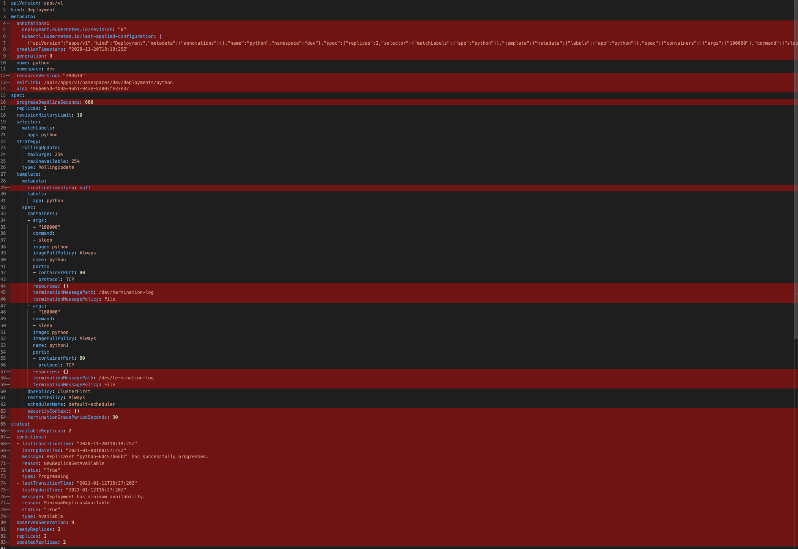

# kubeformat
Tool to remove junk from kubectl manifests. For those of you who are also tired of kubectl flooding you with useless information. Also my coursework. 
# Installation
```sh
wget link_to_latest_release -O kubeformat
chmod +x kubeformat
mv kubeformat ~/usr/local/bin/kubeformat
```
### Features:
* Cleans up fields using filters defined in cmd/defaults.go or in -p filename. Sample JSON with filters can be found in sample/. Usage: `... | kubeformat -p filepath`. Note that wildcard (*) only works for containers, and you should escape irrelevant dots with \\\\
* Iterates over containers(container filters are defined with \*, "spec.template.spec.containers.\*.terminationMessagePath")
* Removes empty fields
* Flattens Lists
# Example

### TODO
* Improve and unify error handling, right now its a mess
* Add tests
* Refactor function and variable names to be in line with conventions
* Maybe add statefulness (path to filters)
* Add parsing of multiple manifests (--- case)
* ~~Maybe add optional secret decoding from b64~~
* ~~Output in JSON~~
* ~~Cleanup out-of-the-box CLI flags~~
* ~~Read input from files~~ cat file | kubeformat accomplishes the same
* ~~Add installation guide~~
* ~~Importing custom filters~~
# Usage
```sh
kubectl -n default get deployment | kubeformat
```
